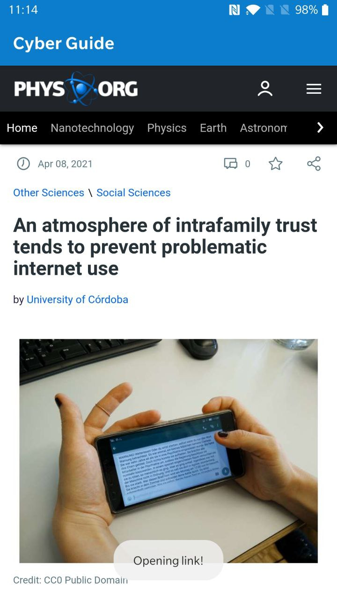

## Cyber Guide (Cyber Bullying Detection System)

<em>Built with Java</em>

<h4>The group project was completed as part of the Software Engineering subject in BSc Computer Science(2021)</h4>

- A clear and precise Software Requirements Specification (SRS) document was prepared for a cyberbullying detection system.
- A ‘Latest News’ module was implemented to display news related to Cyberbullying.
- The News API was used to retrieve the latest news, providing up-to-date information on Cyberbullying.
 

